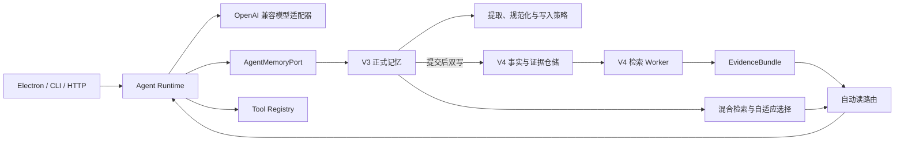
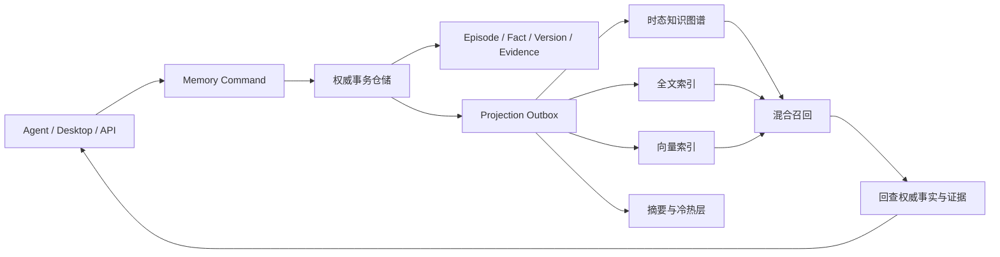

# Continuum Memory

Continuum Memory 是一个面向 AI Agent 的本地长期记忆项目。它希望把记忆从单次对话和单个模型中分离出来，形成可独立运行、可审计、可跨会话共享的记忆模块，并通过 HTTP、SDK 或 MCP 等适配层接入 Codex 一类 Agent。

仓库当前同时包含 Windows 桌面应用、CLI、HTTP 服务和可复用的 TypeScript 包。现有代码已经实现事实提取、混合检索、时间与冲突状态、证据追踪、加密持久化、V4 影子写入和正式读取回退；知识图谱和大规模增量仓储属于下一步架构方向。

## 项目目标

Continuum Memory 不是简单保存聊天全文，也不依赖模型无限增长的上下文窗口。目标是建立一个独立的记忆基础设施：

- 从对话、工具结果和文件中提取值得长期保存的事实与事件；
- 保存原始来源、事实版本、有效时间、冲突、隐私和作用域；
- 在不同会话和不同 Agent 之间按权限共享记忆；
- 结合关键词、语义、结构化字段、时间和图关系召回证据；
- 让最终注入模型的内容能够回溯到具体事实和原始来源；
- 将索引、摘要、向量和知识图谱作为可重建投影，避免污染权威事实；
- 支持本地优先部署，并允许上层 Agent 更换模型或服务商。

## 当前能力

### 桌面应用

- Electron + Vue 3 Windows 客户端；
- OpenAI 兼容 API 配置和流式聊天；
- 加密保存聊天、API 配置和长期记忆；
- 记忆查看、编辑、恢复、删除及隐私设置；
- 可选本地中文语义模型和图片 OCR；
- V3/V4 自动读路由、Worker 隔离和故障回退。

### 长期记忆

- 本地规则或聊天模型驱动的事实提取；
- 指令注入、密钥和敏感内容过滤；
- `ownerId`、`agentId`、`sessionId` 作用域隔离；
- BM25、本地哈希向量、可选 BGE 向量和结构化字段检索；
- 当前、历史和时间点查询；
- 事实替代、冲突、过期、孤立、抑制和删除状态；
- 自适应候选选择、证据预算和低置信度拒答；
- 聊天消息删除后的来源解除与孤立记忆处理。

### V4 事实与证据模型

V4 已定义并使用以下主要对象：

| 对象 | 作用 |
| --- | --- |
| `MemoryEpisodeV4` | 保存消息、人工声明、图片观察等原始来源 |
| `MemoryCandidateV4` | 保存尚待策略判断或人工审核的候选事实 |
| `MemoryFactV4` | 保存结构化事实、时间、状态、置信度和隐私字段 |
| `EvidenceLinkV4` | 将事实连接到其来源 Episode |
| `MemoryFactVersionV4` | 保存事实修改及事务时间历史 |
| `MemoryDerivedArtifactV4` | 保存可重建的摘要、索引和图边等派生数据 |
| `MemoryDomainEventV4` | 保存事实生命周期审计事件 |
| `RetrievalEventV4` | 区分被检索、被注入、被采用或被纠正的事实 |

当前桌面端仍以 V3 承担正式写入，并在提交成功后旁路同步 V4。默认读取模式为 `auto`：V4 Worker 就绪且证据充分时使用 V4，异常、超时、空结果或证据不足时按请求回退 V3。

## 当前架构



主要包及职责：

```text
continuum-memory/
├─ apps/continuum-memory-electron/  Electron + Vue 桌面应用
├─ apps/cli/                        命令行聊天入口
├─ apps/server/                     Hono HTTP 服务入口
├─ packages/contracts/              Port 接口和共享类型
├─ packages/core/                   Agent 运行时、会话与提示词组装
├─ packages/llm-openai/             OpenAI 兼容模型适配器
├─ packages/memory/                 提取、存储、检索、V4 和评估代码
├─ packages/tools/                  工具注册与内置工具
└─ packages/voice/                  STT、TTS 和音频处理
```

记忆代码主要位于：

- `packages/contracts/src/ports/memory-port.ts`：上层 Agent 使用的记忆接口；
- `packages/memory/src/long-term/`：V3 提取、写入、向量、BM25、时间与召回；
- `packages/memory/src/v4/domain/`：V4 类型和一致性校验；
- `packages/memory/src/v4/dual-write/`：V3 提交后的 V4 影子同步；
- `packages/memory/src/v4/repository/`：V4 快照、加密和 Journal 持久化；
- `packages/memory/src/v4/retrieval/`：多路召回、分层路由与证据选择；
- `packages/memory/src/v4/consolidation/`：摘要、去重与冷热分层；
- `packages/memory/src/v4/evaluation/`：长期模拟、反馈、校准和策略评估；
- `apps/continuum-memory-electron/src/main/`：桌面端持久化、Worker、语义模型和故障恢复。

## 快速开始

要求：Node.js 20 或更高版本、pnpm 9。桌面端主要面向 Windows。

```powershell
git clone https://github.com/obliviar/continuum-memory.git
cd continuum-memory
corepack enable
pnpm install
```

### 运行桌面端

```powershell
pnpm dev:electron
```

首次启动后，在界面中配置 API Key、Base URL 和模型。也可以在 `apps/continuum-memory-electron/config.json` 中使用与 `config.example.json` 相同的结构；该文件不应提交到 Git。

测试时可以指定独立数据目录：

```powershell
$env:CONTINUUM_MEMORY_USER_DATA_DIR = "D:\Temp\continuum-memory-dev"
pnpm dev:electron
```

打包 Windows 目录和 ZIP：

```powershell
pnpm -F @continuum-memory/electron package
```

打包版默认把数据保存在：

```text
<Continuum Memory.exe 所在目录>\ContinuumMemoryData\
```

### 运行 CLI

```powershell
$env:CONTINUUM_MEMORY_API_KEY = "YOUR_API_KEY"
$env:CONTINUUM_MEMORY_MODEL = "gpt-4o-mini"
pnpm dev
```

如使用其他 OpenAI 兼容服务：

```powershell
$env:CONTINUUM_MEMORY_BASE_URL = "https://example.com/v1"
$env:CONTINUUM_MEMORY_API_KEY = "YOUR_API_KEY"
$env:CONTINUUM_MEMORY_MODEL = "your-model"
pnpm dev
```

CLI 默认将记忆保存到 `~/.continuum-memory/memories.json`。输入 `/help` 可查看命令。

### 运行 HTTP 服务

```powershell
$env:CONTINUUM_MEMORY_API_KEY = "YOUR_API_KEY"
$env:PORT = "3000"
pnpm dev:server
```

健康检查：

```http
GET /health
```

发送消息：

```http
POST /chat
Content-Type: application/json

{
  "sessionId": "demo-user",
  "message": "请记住我正在开发 Continuum Memory",
  "model": "gpt-4o-mini"
}
```

当前 HTTP 服务没有身份认证，并使用 `sessionId` 作为 owner 边界，只适合本地开发和受控环境，不应直接暴露到公网。

### 在代码中使用记忆包

仓库内部可以直接使用 `@continuum-memory/memory`：

```ts
import { createMemoryWriter, createVectorStore } from '@continuum-memory/memory'

const store = createVectorStore({
  storagePath: './data/memories.json',
  embeddingModel: 'local-hash-v3',
})

const memory = createMemoryWriter({ store })
const scope = { ownerId: 'local-user', agentId: 'assistant' }

await memory.remember('用户正在开发 Continuum Memory', scope)

const result = await memory.recallAdaptive?.(
  '我最近在开发什么？',
  scope,
  { maxInjected: 5 },
)

console.log(result?.memories)
```

更换存储或接入其他 Agent 时，优先依赖 `AgentMemoryPort`，避免让上层代码直接依赖具体的向量库或 V4 内部结构。

## 常用配置

| 环境变量 | 作用 |
| --- | --- |
| `CONTINUUM_MEMORY_API_KEY` | OpenAI 兼容 API Key |
| `CONTINUUM_MEMORY_BASE_URL` | OpenAI 兼容 API 地址 |
| `CONTINUUM_MEMORY_MODEL` | 聊天模型名称 |
| `CONTINUUM_MEMORY_ENABLED=false` | 关闭长期记忆 |
| `CONTINUUM_MEMORY_PATH` | CLI 或服务端记忆文件路径 |
| `CONTINUUM_MEMORY_OWNER` | CLI 使用的 owner ID |
| `CONTINUUM_MEMORY_EMBEDDING_MODEL` | 向量模型，默认 `local-hash-v3` |
| `CONTINUUM_MEMORY_V4_READ_MODE` | `v3`、`v4-beta` 或 `auto` |
| `CONTINUUM_MEMORY_V4_SHADOW=false` | 禁用 V4 影子运行时 |
| `CONTINUUM_MEMORY_USER_DATA_DIR` | 覆盖桌面端数据目录 |
| `CONTINUUM_MEMORY_BOOT_LOG` | 指定桌面端启动日志路径 |

旧的 `DESKPET_*` 变量仍可读取，新变量优先。

## 数据与安全

桌面端使用 AES-256-GCM 加密会话和记忆文件，随机主密钥由 Electron `safeStorage` 在 Windows 上通过 DPAPI 保护。数据文件与对应的 `*-key.json` 必须一起备份；丢失密钥后无法恢复密文。

CLI 和 HTTP 服务当前默认使用 JSON 记忆文件，并不具备桌面端相同的文件加密保护。处理真实私人数据时，应限制文件权限并使用本地受控目录。

记忆具有 `normal`、`private`、`secret` 敏感级别，以及 `allow-remote`、`local-only`、`ask` 分享策略。被召回不代表一定会发送给远程模型；正式注入前还会执行作用域、状态、时间和分享策略检查。

## 目标实现方向

现有 V4 使用单一 `MemoryV4Snapshot`：事务会克隆完整快照，提交时对完整对象执行校验和 `JSON.stringify()`，Journal 帧也包含完整 payload。该方案便于验证一致性，但随着记忆增长会产生明显的内存、序列化和写放大，因此不会作为最终的大规模存储结构。

目标结构是“权威仓储 + 增量变更日志 + 独立投影”：



大致实现原则：

1. 使用记录级事务仓储代替运行时完整 Snapshot，Snapshot 只用于迁移、导出、备份和测试；
2. 使用 SQLite 一类嵌入式事务数据库保存权威事实、证据和版本，利用数据库 WAL 完成增量持久化；
3. 在同一权威事务中写入轻量 Outbox，由投影工作器按 revision 增量更新图、全文和向量索引；
4. 将 Entity、Fact、Episode 和 Event 建成时态知识图谱，保留 `EVIDENCED_BY`、`SUPERSEDES`、`CONFLICTS_WITH` 等可解释关系；
5. 区分事实边、推断边和导航边，语义相似、共现和访问反馈只帮助找候选，不直接改变事实真值；
6. 投影返回的 Fact ID 必须回查权威仓储，再执行作用域、时间、状态、隐私和证据检查；
7. 通过 HTTP、SDK 和 MCP 适配器向 Agent 提供 `remember`、`recall`、`forget`、`feedback` 和状态查询；
8. 多会话通过 owner、workspace、project、agent 和 session 等作用域共享或隔离记忆。

知识图谱首先作为可重建的检索投影实现。是否采用独立图数据库，由节点规模、查询深度、并发和实测延迟决定；图数据库本身不替代证据、版本和权限模型。

相关研究笔记位于 `docs/research/`。

## 开发与验证

```powershell
# 全仓类型检查
pnpm typecheck

# 全仓测试
pnpm test

# 构建检查
pnpm build

# 只测试记忆包
pnpm -F @continuum-memory/memory test

# 桌面端主进程测试
pnpm -F @continuum-memory/electron test
```

仓库包含事实提取、冲突处理、召回、持久化、迁移、故障恢复、20k 规模检索和一年生命周期模拟等测试。合成与确定性测试用于发现回归，不应等同于真实用户环境下的最终质量结论。

## 当前边界

- 正式写入仍以 V3 为主，V4 通过双写逐步承接读取和证据模型；
- V4 权威仓储目前仍是完整快照持久化，尚未迁移到记录级事务数据库；
- 时态知识图谱、图遍历召回和 MCP 适配器尚未成为正式运行路径；
- CLI 和 HTTP 服务的能力、加密与管理界面少于桌面端；
- 智能提取质量依赖所配置模型，本地规则只能覆盖有限表达；
- 可选 BGE、OCR 和语音资源首次使用时可能需要联网下载。

## License

MIT
