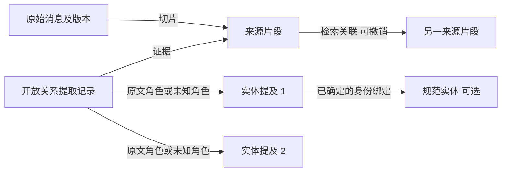

# L1 开放关系利用、UIE 提取与低审核召回设计

日期：2026-10-01  
状态：设计方案，尚未实现；本文不改变现有运行行为。  
目标：让有来源的记忆尽可能被找到，以原文片段或可核对的记忆文本注入提示词，显著减少逐条确认图事实的操作。不安排工期。

## 1. 核心决策

L1 保存来源片段、实体提及、开放关系和语境，承担检索入口与关联导航职责。业务关系无需预先注册，结构有效的提取结果可以自动参与检索。L2 的自动关联作为检索路线，影响候选扩展和排序；它不自动成为回答中的确定关系。

最终提示词接收来源文本与必要语境，不把图路径改写成一条新记忆。提取为空、关系不明、UIE 不可用，都不能让已保存且有权限的原文失去检索资格。

审核分为机器校验和用户决定：证据位置、来源版本、权限等由机器处理；不确定身份默认不合并，不要求用户清空待办才能使用记忆。仅在用户请求合并、纠正或当前问题确实需要消除歧义时按需确认。

保留现有规范 Claim 与正式 L2 关系，用于已经支持的严格查询。新增开放召回路径，不把所有开放记录强行转换为 `verified` Fact，也不把原有人工确认状态扩大解释为现实真实性。

## 2. 当前代码的实际限制

| 位置 | 当前行为 | 对本方案的影响 |
| --- | --- | --- |
| `packages/memory/resources/uie_extract.py` | 默认 schema 包含人物、影视、歌曲等目标；支持逐请求 `set_schema` | 已能动态提取，但默认目标不覆盖任意领域 |
| `long-term/local-uie.ts` | 保留未知标签；图自动语境判断依赖 `RELATION_CUES` 与分数 | 固定线索表不应继续决定开放召回资格 |
| `repository/open-assertions.ts` | 投影开放候选及不符合注册表的事实；以原文跨度保存参与者 | 可复用；需统一收录可用提取，避免同一片段重复输出 |
| `repository/open-assertion-admission.ts` | 否定、计划、转述、非字面关系标签、低分等会阻止自动导航 | 这些应改成语境或质量特征，通常不再进入人工待审 |
| `domain/open-assertion-types.ts` | `claimPublication: false`、`sharePolicy: local-only` 等固定限制 | 需要独立的原文召回协议和权限评估，不能只删除审核分支 |
| `adapters/accepted-l1-input.ts` | 主聊天图召回依赖有效 V4 Fact 和已接受 Claim | 开放记录缺少正式聊天入口 |
| `domain/relation-types.ts` | 正式 L2 以两个 Claim 为端点，记录已采纳的逻辑关系 | 自动检索连接应使用独立协议，不能冒充正式关系 |
| `core/prompt/graph-evidence-prompt.ts` | 只接收直接 Claim 与受支持的正式关系 | 需要添加来源片段证据格式 |
| 桌面 `index.ts` | 图召回由 `CONTINUUM_GRAPH_MEMORY=1` 控制，远程模型只读获准发送的数据 | 写入图不等于进入提示词；切换与观测必须一并设计 |

当前原生图写入的 `canonicalText` 是 `run.sourceText.slice(evidenceSpan.start, evidenceSpan.end)`，已经是原文片段。其他 V3/V4 记忆路径可能使用提取整理后的正文。不能根据字段名推断所有路径都是原文，也不能把“来源可定位”当作“上下文已完整送入模型”。

## 3. L1 的基本结构

采用“来源片段作为连接中心”，支持两个或多个参与对象。不要把同一消息里的实体两两连成真实关系。



必须预定义的只是少量结构连接：来自来源、涉及提及、已确定的身份绑定、同一对话中的邻接。`喜欢`、`存放位置`、`调试依赖`等业务关系使用开放文本；没有业务关系也可保存片段及提及。

### 3.1 来源片段 `SourceFragmentRecord`（新增）

作为开放召回和自动 L2 的稳定端点。相同原文片段被不同提取器重复处理，不应产生多份回答材料。

必要字段：

- `ref`：`source-fragment` 类型、稳定 ID、版本。
- `sourceRef`：区分 `capture` 与 `episode`，包含来源 ID、版本/内容哈希和 UTF-16 范围。
- `scope`：所有者、来源 agent、会话；预留记忆库引用，由访问层决定可读范围。
- `text`：可缓存的精确原文切片；来源仍是权威，读取时验证一致性。
- `recordedAt`、`speakerRole`、`contextRefs`：消息时间、说话者和所需上下文的精确引用。
- `contextCompleteness`：完整、部分、未知；限定在已检查窗口内，不宣称整段对话无歧义。
- `sourceStatus`、`usagePolicyRef`：来源生命周期和使用权限引用。

ID 由来源身份、修订、范围和分段规则版本决定，不由 UIE 分数、schema 或模型版本决定。更换分段规则产生新的投影引用并重建索引。

`CaptureSource.contentHash` 当前覆盖消息与附件，UIE 的 `sourceRevision` 覆盖送入提取器的文本；两者不是同一种哈希。新协议分别记录来源完整性与文本完整性，不混用，不把 capture ID 填进现有 `episodeId`。

### 3.2 实体提及 `MentionRecord`（提取为可复用结构）

保留原文名称、位置、类型候选、提取来源。一个提及可有多个类型建议；类型冲突不丢弃原文。

身份绑定分成三种：确定绑定、可能相同、未绑定。只有显式 ID、可信会话身份或已确认映射才建立确定绑定；名称一致、向量相似、同属一个话题只用于寻找候选。第一人称仅在宿主明确说话者身份时绑定该用户，引用中的“我”不自动归属当前用户。

### 3.3 开放关系 `OpenRelationObservation`（扩展现有开放断言）

复用 `GraphOpenAssertionRecord` 的参与者、证据与语境。增加/明确以下内容：

- `fragmentRef`：锚定来源片段。
- `relationLabel` 与 `labelOrigin`：区分原文短语、UIE schema 标签、模型建议。
- `relationSpan`：仅原文确有对应短语时提供；UIE 的“存放位置”不必在原文中逐字出现。
- `participants`：任意数量提及及角色候选，允许角色未知。
- `extraction`：模型修订、schema 指纹、原始分数、运行状态。
- `validation`：结构校验结果；模型分数不是真实性概率。
- `context`：否定、条件、计划、转述、时间、说话者等，允许未知且可追溯。
- `userDecision`：无决定、纠正、拒绝；与机器自动准入分开保存。

同一原文有多个提取解释时保留解释的来源，但注入阶段按来源和范围去重。已注册关系也可提供相同的开放导航视图，不需要因注册表命中就失去宽松召回入口。

## 4. 将逐条审核改为自动准入

不要用一个 `approved` 布尔值决定所有用途。分别评估：来源可读、可建立连接、可检索、可发送、可参与身份合并、可作为严格推理前提。

| 情况 | 保存及索引 | 自动连接与召回 | 人工处理 |
| --- | --- | --- | --- |
| 未知关系、未知实体类型 | 保存有效提取与原文 | 允许开放导航 | 无 |
| 关系标签未在原文逐字出现 | 标记 schema/模型标签 | 参与者与来源有效即可作为候选线索 | 无 |
| 否定、假设、计划、疑问、转述 | 保存完整语境 | 按问题相关性返回；保留表达性质 | 无 |
| 有效跨度但模型低分 | 保留提取观测与来源 | 弱连接降权/不扩展，原文照常检索 | 无 |
| 指代不明或同名对象 | 保存独立提及 | 不确定身份只作候选，不自动归属 | 通常无；必要时按需澄清 |
| 跨度越界、对象不在来源、损坏输出 | 原文仍保存；坏提取留诊断 | 不发布坏连接，可自动重试 | 不转成用户待办 |
| UIE 整体失败或无结果 | 原文照常索引 | 文本/向量召回 | 无 |
| 原文已删、版本失效、无读取权限 | 按生命周期保留或清除 | 不返回失效/无权限材料 | 无 |
| 用户拒绝、纠正、停止使用 | 保留相应决定与失效记录 | 不由新策略自动覆盖 | 用户主动恢复时再处理 |

取消用 `modelScore >= 0.85`、否定关键词和字面关系匹配统一控制开放召回资格。对低质量连接可设置机器侧预算或抑制阈值，但不能连带禁止来源文本检索，也不能把低分转成人工任务。

疑问、指令等片段不是个人事实，但可能是“之前让我做什么”的有效记忆。返回时标明来源角色和表达性质，提示词按不可信历史数据处理。

提取 run 部分失败时，仅当新校验器能证明每个候选引用和位置独立完整时接收该候选；否则只保留来源检索。不能简单跳过现有 `run.status === complete` 检查。

## 5. 开放关系如何真正改善召回

### 5.1 多入口找候选

对同一授权范围并行检索：原文片段 BM25/关键词、已配置的真实语义向量、实体提及与别名候选、已有规范记忆。分词、数字和设备编号适配中文对话，原始文本不被索引归一化覆盖。

按排名融合候选，避免直接相加 UIE 分数、余弦相似度和 BM25 分值。无向量模型时回退文本检索并报告当前能力，不能宣称跨措辞召回等价。新增持久化片段索引；当前开放查询的临时向量窗口不足以承担完整聊天召回。

### 5.2 有界扩展

由片段出发，经开放关系找到参与提及，再到可能相关的其他片段。确定身份、同一对话邻接提供较强路线；同名候选和语义近邻是较弱路线。

- 每个候选保留路线、深度、身份确定程度和来源引用。
- 同名/代词/常见词不产生无上限扩展；“我”“这里”“项目”等不能成为跨库通用连接点。
- 初始可采用 2 跳、32 个种子、64 个扩展片段、每节点 8 个邻居，均为可调起点，需通过实验选定。
- 按“片段精确版本”去重并防环；为多实体、多路线预留预算，避免一个高连接度对象占满结果。
- 扩展后重新对照原问题排序，路径分数不替代片段内容相关性。
- 每条路线和跨来源端点都执行权限检查，不允许通过共享节点进入未授权记忆库。

“为什么”等问题优先探索解释/因果线索，但即使不存在相应 L2 边也继续原文检索，不以缺少正式关系为失败条件。无法确定查询类型时使用通用检索，只有回答需要消除歧义时才问用户。

### 5.3 恢复完整语境，再组装输出

命中片段后回读权威来源：至少覆盖完整句子，补足条件、否定、引述范围；若包含指代，按已有消息引用补取必要前文。补取对象也需要授权。找不到足够语境时明确标记不完整，不猜测被指对象。

重叠片段按来源修订和范围合并；同一片段的开放关系、规范 Claim 和关键词命中只占一份正文。不同来源即使内容相同也保留各自归属，不能因此做实体合并。

预算以最终渲染后的提示词计数。宁可减少条目，也不截掉关键否定或条件。并列冲突片段尽可能保留，更新时间不自动等于事实生效时间，不自动覆盖旧记忆。

### 5.4 新的来源证据包

新增 `SourceRecallEvidence`，与现有 Claim 证据并列；引用使用 `S1` 等独立标识，不伪造 `GraphClaimRef`。

```ts
// 概念协议，具体类型在实施时与 contracts 对齐。
interface SourceRecallEvidence {
  citation: string
  fragmentRef: SourceFragmentRef
  sourceRef: CaptureOrEpisodeSourceRef
  content: string // 精确来源片段
  context: Array<{ sourceRef: CaptureOrEpisodeSourceRef; content: string }>
  speakerRole: string
  recordedAt: number
  contextCompleteness: 'complete-in-window' | 'partial' | 'unknown'
  interpretation: 'source-material'
}
```

可附上非确定的时间/语境提示，但不允许模型建议覆盖原文。检索路径主要供调试界面使用；若需要传给回答模型，置于独立的 `retrievalHints` 并声明只表示发现路线。不得混入现有 `relations` 当成已确认因果关系。

发送前再次验证来源版本、撤销状态和权限。来源变更则剔除或有界重试；可继续返回其他有效证据，不把失效文本留在模型工具调用后的下一轮提示词中。

## 6. L2 改为支持自动检索连接

新增 `GraphNavigationLink`，端点为来源片段引用。现有严格 `GraphRelationRecord` 继续保持原语义和审核约束，两者用途明确分开。

建议导航类型：共同提及、语义相近、同一话题候选、对话相邻、时间线索、可能解释、可能冲突。类型集合只定义遍历策略，业务关系原文依然开放。记录生成方式、质量分数、模型/策略版本、端点版本及 `purpose: retrieval`。

普通问题采用相关性优先的有界扩展；时间问题优先读取有明确时间依据的片段并附邻近材料；解释问题优先解释线索，同时允许其他路线补足。粗粒度类型作为软偏好，不作为唯一允许遍历的硬过滤器。

自动 L2 对比仅针对共享来源、实体候选或文本/向量近邻，控制每个新增片段的邻居数，避免全库两两比较。NLI 可对已选文本对生成关系提示，但不证明事实真假、同名实体相等或真实因果；首次接通开放召回不必等待 NLI 全量处理。

导航连接允许自动生成、更新和失效，无人工审批。它不能进入规则推理器，也不授予原文发送权限。用户确认的正式 L2 关系仍可独立返回，其引用与导航提示分开。

## 7. 处理 UIE 约束：降低依赖并按需补全

UIE-base 按自然语言 schema 执行目标提取，支持运行时更换 schema；不提供“无需目标即可自动发现全部关系”的保证。其约束应只影响结构丰富程度。

### 7.1 写入时

1. 先持久化原文及分段索引任务；文本索引尽快可用，语义索引和提取可异步完成。
2. 执行小型基础 schema，优先人物、组织、地点、项目、时间等实际对话需要的目标。先以现有默认 schema 作对照实验，再缩减影视等不常用目标，防止未经验证的精简损失召回。
3. 领域路由器参考原文、agent 已有配置和用户明确选择，自动选少量领域目标。初始每段最多 2 个目标包、总计约 16 个标签作为实验预算，不是准确率保证。
4. 对结果逐项校验并写入开放结构。未命中、低分或类型未知均不制造审核任务。
5. 现有句式规则仅作为额外入口；保留其规则版本，不声称它覆盖所有关系。

### 7.2 动态 schema 从哪里来

- 第一阶段：少量领域模板 + 原文/问题关键词路由；用户不需要为每段话配置 schema。
- 第二阶段：查询驱动的缺失字段，例如“在哪里”尝试位置目标，“谁负责”尝试负责人目标。保存目标来源和尝试结果。
- 可选增强：在已启用且获准处理该来源的智能提取模式内，让模型提出少量目标或开放关系，再用原文对齐校验；不要默认增加远程调用。
- 高频有效目标可以进入该 agent 的有限缓存。缓存只影响下一次提取，不修改全局本体，不把重复命中当作真实关系确认。

仅指定“实体、关系”等宽泛标签不等于取消 schema，也不能据此宣称具有开放关系发现能力。把 schema 换成新名称不需要逐次重新训练，但实际效果必须用该领域样例检验。

### 7.3 查询时补提取

先从原文索引取得候选，再对其中少量高相关片段执行定向 UIE，禁止反过来要求“先有 UIE 结果才能成为候选”。

仅在缺少有用结构、候选含明确提取目标且还有预算时触发；已有原文足以回答时跳过。初始可限制每轮最多 3 个片段、每片段一次组合 schema；超时直接返回已找到的原文。具体耗时预算根据本机 UIE 测量设置，不能在模型加载慢时无限等待。

缓存键包含来源修订、片段范围、schema 指纹、UIE 模型修订、适配器版本；空结果也短期缓存，避免重复消耗。幂等任务与过载丢弃机制沿用后台处理思路。来源撤销立即让缓存不可读。

当前 Python 桥接每次重设 schema，可复用；并发请求必须经单实例队列或独立实例处理，防止 schema 状态串扰。当前输入上限为 4000 个 Python 字符，TypeScript 使用 UTF-16；分段与偏移转换沿用明确的单位校验，保留窗口到完整来源的映射。schema 限额仍需检查。

### 7.4 能力边界

如果新领域内容没有关键词重合，语义模型也未找回它，查询时补提取无法补救，因为它尚未进入候选池。因此必须独立评估原文文本/向量召回，并对低覆盖领域改进分词、别名候选或基础目标；不能把动态 schema 当作完整召回保证。

## 8. 权限与多 agent 使用

当前原文信息节点和开放断言固定为 `local-only`，API 聊天只读取 `allow-remote`。仅改审核不会使开放记录进入提示词。

为来源建立明确的使用策略记录，区分本地索引、共享给哪些 agent、是否允许发送给当前模型。有效权限取来源策略、记忆库授权和请求限制的交集；扩展上下文与派生索引不能放宽来源权限。

新来源可继承用户已明确选择的记忆库级策略，避免逐条询问。旧记录的 `local-only` 和用户拒绝继续生效；不能为提高召回而批量改成远程可发送。若用户选择批量调整某库发送权限，应作为一次独立、可见的设置操作。

当前 owner/agent/session 隔离继续生效。未来共享库由宿主解析可读库集合，导航只能在该集合内进行；不要把“共享”实现为取消 agent 校验。此次设计不假定跨 agent 分享已实现。

## 9. 审核界面与指标

默认显示“已保存来源”“可检索片段”“提取处理中/失败”“本次实际引用”，不把模型不确定性累计成待处理红点。

实体管理保留合并/拆分、标记不同对象、编辑别名等主动操作。出现同名候选时正常保留多个来源；只有当前问题必须在它们之间选一个，且无法从上下文确定时才问用户。

提取错误可通过“这段关联不正确”反馈，定位到提取观测；记忆内容不再使用则定位到片段/来源。区分两类撤销范围，避免纠正一条坏边时删掉正确原文，也避免停止使用后被原文回退路线重新带回。

界面展示分数时标明提取或相关性评分，不叫事实正确率。后台失败支持重试与诊断，不要求用户确认一条损坏的结构。

## 10. 核心模块及修改位置

| 模块 | 职责 | 对现有代码的处理 |
| --- | --- | --- |
| `SourceFragmentCore` | 切片、来源定位、版本与上下文恢复 | 基于 `capture-repository.ts`、`captured-information.ts` 新增来源片段层 |
| `ExtractionValidationCore` | 逐项跨度、对象引用和运行状态校验 | 复用提取协议校验，拆开完整性与语义审核 |
| `OpenL1IndexCore` | 提及、开放关系、稳定投影及索引 | 扩展 `open-assertions.ts`、`l1-projection-repository.ts` |
| `MentionIdentityCore` | 确定身份与候选身份分离，可逆合并 | 复用已有 identity normalization，不以候选相似度自动合并 |
| `UieSchemaPlanner` | 基础/领域/查询 schema 与预算 | 扩展 `local-uie.ts`、`uie_extract.py`；保留原始输出 |
| `NavigationLinkCore` | 片段之间的自动导航连接 | 新增端点与持久化协议，不替换正式 `relation-types.ts` |
| `SourceRecallCore` | 多路检索、有界扩展、重排和去重 | 新增开放读适配器，组合既有规范记忆召回 |
| `SourceEvidenceAssembler` | 回读原文、恢复语境、最终权限检查、token 预算 | 新增来源证据协议并接入 core 提示词 |
| 桌面接入 | 原文策略、切换、队列和观测 | 调整主进程运行时及管理界面 |

优先新增来源证据协议；旧 `GraphSourceRef` 专用于 Episode、旧 `GraphAnswerRef` 专用于 Claim，不能用类型断言绕过。新返回包可以采用独立版本或显式新增能力字段，旧消费者不认识新类型时不投递。来源召回不需要先创建空壳 V4 Fact。

## 11. 实施顺序与旧数据迁移

按依赖拆成可验收阶段，不分配工期：

1. 完成来源片段、权限与证据包协议，接通“原文索引 → 实际聊天提示词”，UIE 为零结果时也可通过检索用例。
2. 调整开放准入与提及索引，让已有开放关系参与扩展；移除对应的常规人工待审。
3. 加入自动 L2 导航连接及重排，验证对召回覆盖和噪声的净收益。
4. 追加领域 schema 与查询时补提取，比较增益与耗时；在前述链路可用后再扩大覆盖。
5. 根据离线和回放结果逐步成为默认路径；明确设置项和启动状态，避免仍被旧环境开关静默禁用。

迁移只重建可派生索引与导航记录：原始 capture、UIE rawOutput、人工确认/拒绝、原有正式 Claim 与关系保持可追溯。

- 活跃来源自动建立片段，不需要用户点击逐条重审。
- 旧策略待审但没有用户决定的记录可自动获得来源检索资格；不伪造“用户已确认”。
- 旧拒绝/停止使用默认不经新回退路径重新出现。旧决定缺少范围时采用保守的排除范围，并允许用户主动调整。
- 只有坏提取被明确拒绝、且来源仍获准使用时，才允许来源检索绕过该坏边。
- 无活跃原文的旧规范记忆继续走既有路径，不为它补造原始对话。
- 新路径先进行不影响回答的影子比较，再启用；回退旧路径时保留新增来源数据，派生索引可重建。
- 文档验收和实现验收分开；本文不表示这些步骤已经执行。

## 12. 评估与验收

使用相同来源、问题和最终 token 预算比较：现有路径、仅原文检索、原文加开放 L1、再加自动 L2、再加动态 UIE。按领域和会话分离开发集与留出集；不只在 UIE 已命中的样例上测效果。

主要指标：证据 Recall@K、Precision@K、必要上下文保留率、同名误归属率、每百条输入的人工处理次数、每次回答实际追问次数、p50/p95 延迟、UIE 调用量及提示词开销。按来源范围去重计算，避免同一片段多个图节点虚增召回。

人工负担目标可先设为：同一代表性数据集上，每百条输入的确认需求相对旧策略下降至少 80%；未知谓词、否定/计划/转述、低分本身不产生强制确认。此数值是待验证目标，不是已测结果。同时单独记录用户纠错次数，防止把审核负担转移成纠错负担。

召回目标应以基线实测确定：默认切换前要求证据 Recall@K 不劣于基线且改善未知领域表现，并明确 Precision@K、延迟与 token 的可接受边界。不能只凭待审核数量下降验收。

必须覆盖的行为用例：

| 用例 | 预期 |
| --- | --- |
| 完全未知领域，UIE 零结果 | 活跃原文仍可通过文本/可用向量路径找到 |
| UIE 标签不在原文逐字出现 | 有效参与提及可建立候选连接，无人工待办 |
| “我没有住在成都” | 返回包含否定的原文，不输出肯定的居住事实 |
| “如果搬家，我考虑去成都” | 条件不被截断；无强制审核 |
| 两个同名人物、引用中的“我” | 不自动合并或错误归属 |
| 三参与者放置事件 | 返回完整事件，不任意补造两两关系 |
| 错误的 L2 因果候选 | 仅影响候选搜索，不作为正式因果证据注入 |
| 一个话题下大量连接与循环 | 遍历有界，多路线保留合理覆盖 |
| 来源编辑/删除、工具执行后撤销 | 下一轮发送前排除旧内容和失效连接 |
| 原文与规范 Claim 同时命中 | 不重复占用正文预算 |
| 用户拒绝/停止使用的旧记录 | 重建和原文回退均不恢复使用 |
| 不同 agent、共享库及远程权限 | 只返回本次获准访问和发送的来源 |
| 无语义模型、UIE 失败或超时 | 明确降级，原文路径仍能工作 |
| 多 schema 交错请求、Unicode 字符 | schema 不串扰，范围映射不损坏 |

验收还应直接检查发给模型的实际 payload：开放来源确实出现，关系提示未冒充事实，原文和元信息对齐，敏感及已撤销来源没有通过其他通道绕过限制。来源复现与权限类确定性测试要求全通过；这不等于证明所有自然语言回答永远正确。

## 13. 依据

上述现状来自当前仓库代码检查；预算、协议名称与指标目标属于本方案建议。

- [UIE 桥接](D:/GitHub/continuum-memory/packages/memory/resources/uie_extract.py)
- [开放断言投影](D:/GitHub/continuum-memory/packages/memory/src/graph-core/repository/open-assertions.ts)
- [当前自动导航准入](D:/GitHub/continuum-memory/packages/memory/src/graph-core/repository/open-assertion-admission.ts)
- [当前图事实正文生成](D:/GitHub/continuum-memory/packages/memory/src/long-term/graph-l1-write.ts:359)
- [当前图提示词](D:/GitHub/continuum-memory/packages/core/src/prompt/graph-evidence-prompt.ts)
- [PaddleNLP UIE 官方说明](https://github.com/PaddlePaddle/PaddleNLP/blob/develop/slm/model_zoo/uie/README.md)：自然语言目标 schema 与 `set_schema` 动态切换；不据此推断任意目标的准确率。
