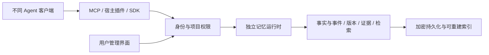

# Continuum Memory 外置记忆组件：应用人群、竞品与验证建议

调研日期：2026-09-14。依据为当前工作区代码、项目现有评测报告，以及本次检索的官方文档和项目仓库。竞品功能按公开资料描述，未安装实测；场景排序、商业路径和验收目标是产品假设，尚无用户访谈或付费数据支持。本次工作为分析，不包含模块拆分或性能复测。

建议把记忆模块独立出来进行产品验证，定位为“用户可管理、可跨 Agent 使用的长期记忆服务”。首批聚焦在多个 Agent 之间切换、持续处理同一个项目的个人开发者和技术知识工作者。市场已经存在非常接近的实现；机会需要通过接入体验、记忆质量、纠错效率和特定场景证明。

**对用户的核心承诺可以是：换一个 Agent，工作仍能接着做；每条被使用的记忆，都能查清来源、适用范围和变更历史。**

这里的“长期记忆”通过外部存储、检索和上下文注入实现，不更新基础模型权重。应分别管理个人偏好、项目事实、发生过的事件，以及经过验证的操作经验。当前项目最接近前两类；事件和操作经验需要进一步完善来源模型和验证方式。

项目现状决定了可拆分范围。

| 当前基础 | 拆分价值 | 需要补齐的边界 |
| --- | --- | --- |
| 独立的 `@continuum-memory/memory` 包，依赖 contracts 和模型 SDK | 可以复用已有引擎，减少从头实现 | 当前包是 private，直接导出 TypeScript 源码，尚未形成对外发行合同 |
| `AgentMemoryPort` 包含 capture、remember、recall、update、forget、purge 等操作 | 已有较清晰的服务边界 | 外置服务需要稳定的请求结构、错误语义和权限检查 |
| 事实状态、有效时间、来源 ID、隐私属性、证据包和自适应召回 | 可以形成可查看、可纠正的记忆管理体验 | 不能仅把存储和搜索暴露出来，必须保留状态与来源语义 |
| V3 正式写入、V4 旁路同步及正式读路由 | 已有降级和恢复的工程积累 | V4 Worker、运行观测和部分装配仍在 Electron 主进程目录 |
| 加密持久化通过 protectKey / unprotectKey 注入密钥保护能力 | 加密核心有适配空间 | 当前桌面宿主使用 safeStorage；无界面服务和其他系统需要自己的密钥适配 |
| 已有 HTTP server | 有服务端入口可参考 | 当前主要提供聊天和语音路由，未形成独立的记忆 API |

代码依据：[记忆包配置](D:/GitHub/continuum-memory/packages/memory/package.json)、[统一记忆接口](D:/GitHub/continuum-memory/packages/contracts/src/ports/memory-port.ts:151)、[加密适配接口](D:/GitHub/continuum-memory/packages/memory/src/long-term/encrypted-persistence.ts:45)、[服务端入口](D:/GitHub/continuum-memory/apps/server/src/index.ts:39)、[桌面装配](D:/GitHub/continuum-memory/apps/continuum-memory-electron/src/main/index.ts:626)。

一个具体限制是：当前 HTTP server 为避免未鉴权情况下的跨会话泄漏，将 sessionId 用作 ownerId。这意味着它还不能直接承担“同一用户跨会话、跨 Agent 共享记忆”的产品职责。现有 MemoryScope 包含 ownerId、agentId、sessionId；项目空间、团队、客户端授权和共享规则需要进一步设计。新增字段本身不能替代服务端鉴权。

另一项限制是证据成熟度。现有内部报告记录了回归、365 天确定性模拟、20k 规模测试及故障恢复，但明确没有外部盲测、真实 BGE 或公开 LongMemEval-S 成绩。内部高分不能用于证明领先竞品；本次也未重新运行这些实验。[内部功能基线](D:/GitHub/continuum-memory/evals/memory/internal-baseline-15828aa.md)

应用人群可以按“重复交互频率 × 历史信息价值 × 接入可控程度”排序。

| 优先级 | 使用者与潜在付费者 | 具体需要记住什么 | 可验证的收益 | 主要补课 |
| --- | --- | --- | --- | --- |
| 第一批 | 使用多个 Agent 的个人开发者、技术创作者 | 项目约束、架构决定、偏好、未完成事项及其变更 | 新会话恢复更快，少重复解释，少违背已确认的决定 | 项目隔离、来源接入、宿主生命周期适配 |
| 第一批 | 本地 AI 助手和桌面 Agent 爱好者 | 称呼、偏好、长期目标、项目近况 | 换模型或客户端后仍能延续使用体验 | 安装、迁移、导出、中文质量和资源占用 |
| 第二批 | AI 应用开发者、小型 SaaS 团队 | 用户画像、偏好变化、对话事实 | 少开发一套记忆系统，降低维护负担 | 稳定 SDK、部署文档、多用户隔离、成本观测 |
| 第二批 | 研究者、咨询师、作者等长期项目工作者 | 决策原因、研究进展、人物关系、约束的历史 | 从中断处继续工作，知道某项结论为何形成 | 文档来源与对话来源对齐；区分证据和推断 |
| 后续 | 客服、客户成功、销售团队 | 历次沟通、承诺、偏好、尚未解决的问题 | 减少重复询问和交接损失 | CRM/工单接入、团队权限、外部系统纠正同步 |
| 后续 | 教学产品与长期学习助手 | 已掌握知识、重复错误、教学节奏 | 教学策略能随长期表现调整 | 领域评测、画像纠错和更细的用户控制 |
| 后续 | 多 Agent 团队、企业内部助理 | 任务交接、共享决定、已验证操作经验 | 减少重复探索和错误传播 | 并发、版本一致性、共享授权、工具结果验证 |

建议先验证一个明确人群：**每周多次使用至少两个 Agent 处理同一长期项目，已经需要反复粘贴背景说明的人。**这比“所有使用 AI 的人”更容易观察效果。桌面助手用户与现有能力更贴近；开发者能够帮助检验跨工具接入，但需求不能直接扩大为自动学习所有编程经验。

客服场景的交易状态、订单金额等，应由业务系统提供权威值；记忆服务保存沟通背景、历史事件和指向原始记录的证据。多个 Agent 共享时，也要明确“谁知道什么、哪些项目可用”，避免把所有历史混成一个全局资料库。

以下项目与产品值得对标。描述反映检索时的官方资料，不代表本项目已复现其功能或指标。

| 项目 / 产品 | 公开定位和能力 | 对本项目的意义 |
| --- | --- | --- |
| [Mem0](https://github.com/mem0ai/mem0) | 通用记忆层，提供库、自托管服务和托管平台；当前有混合检索、实体关联和时间检索 | 必须比较开发者接入成本、管理能力和实际记忆质量；开源库与云平台能力需分开比较 |
| [Supermemory](https://supermemory.ai/) | 通过 API、插件和 MCP 提供跨模型记忆，强调持续提取、整理和上下文注入 | 与“独立于模型的记忆服务”定位直接重叠，跨模型本身不是充分区分点 |
| [Graphiti / Zep](https://help.getzep.com/zep-vs-graphiti) | Graphiti 是时间知识图谱框架；Zep 提供托管的企业记忆与治理系统 | 对标动态事实、来源、历史查询及企业产品化；不能把 Graphiti 与完整 Zep 服务视为同一交付物 |
| [Hindsight](https://github.com/vectorize-io/hindsight) | 使用 retain、recall、reflect 操作，组织事实、经历和从证据归纳的观察，提供 MCP 等接入 | 对标事件记忆、经验归纳和召回后的推理能力 |
| [MemOS](https://github.com/MemTensor/MemOS) | 覆盖长期记忆、多模态、工具轨迹和多个记忆空间；同时有云服务、自托管及本地插件 | 本地插件、中文生态和可管理记忆已有人做；需要比较具体使用体验 |
| [EverMe](https://github.com/EverMind-AI/EverMe) / [EverOS](https://github.com/EverMind-AI/EverOS) | EverMe 提供 CLI、MCP 和宿主插件，连接托管服务或兼容的自托管引擎；EverOS 强调可携带的本地记忆 | 产品分层很值得参考：引擎、接入工具、托管账户各自独立 |
| [Basic Memory](https://github.com/basicmachines-co/basic-memory) | 以 Markdown 文件为资料源，人与 AI 双向编辑，通过 MCP 使用；有可选云端和团队服务 | 对标用户能理解、编辑和带走记忆的体验；也构成研究与知识工作场景的竞争 |
| [LongMemory，原 CaviraOSS/OpenMemory 路径](https://github.com/CaviraOSS/LongMemory) | TypeScript 引擎、本地 SQLite、来源与时间历史、证据选择、上下文预算，以及 CLI/HTTP/MCP/管理界面 | 技术方向非常接近，应该列为重点对照；证据链、时间管理和本地 TypeScript 都不能宣称独有 |
| [Claude-Mem，当前 README 使用 Grok Mem 品牌](https://github.com/thedotmack/claude-mem) | 捕获工作过程、生成摘要、向后续会话补充相关上下文，提供宿主 hooks 和搜索工具 | 对标“装好后自动工作”的接入体验，名称和当前支持范围应以最新仓库为准 |

还应观察三类替代方案：[LangMem](https://langchain-ai.github.io/langmem/) 提供提取、后台更新及 LangGraph 集成；[Letta](https://docs.letta.com/agent-sdk/memory) 把持续记忆、MemFS 和记忆整理纳入有状态 Agent；[Amazon Bedrock AgentCore Memory](https://docs.aws.amazon.com/bedrock-agentcore/latest/devguide/memory.html) 提供托管的短期与长期记忆。用户可能直接使用框架或云平台附带能力，因此独立产品必须降低接入和迁移负担。

轻量比较基线还包括 [MCP 官方 memory reference server](https://github.com/modelcontextprotocol/servers/tree/main/src/memory)：以实体、关系和观察构成本地持久知识图谱。可以用它检验更复杂的引擎是否确实带来收益。

名称需要特别核对。Mem0 在 2025 年推出过 [OpenMemory MCP](https://mem0.ai/blog/introducing-openmemory-mcp)，其本地共享记忆和管理界面与本设想高度相似。但本次访问旧的 `mem0ai/mem0/tree/main/openmemory` 路径返回 404，当前应以 [Mem0 MCP 文档](https://docs.mem0.ai/platform/mem0-mcp) 和现行自托管文档为入口。单次 404 不足以证明整个产品停止维护。CaviraOSS 的 OpenMemory 路径则重定向到 LongMemory；二者不能混为同一个项目。

差异化应转成用户能检验的动作。

1. **解释一次召回。**显示它来自哪段用户陈述或已验证事件，何时生效，为什么现在被选中，是否有冲突版本。
2. **纠正一次错误。**用户改正项目约束后，另一个 Agent 下一次查询即使用新状态；历史查询仍能说明过去的选择。
3. **控制一次共享。**个人偏好、项目资料、团队决定分别授权，用户能够看到某客户端可读取的范围。
4. **撤销一次记忆。**普通停用、恢复和彻底删除有不同语义；对索引、摘要、缓存和源引用的处理可检查。备份中的保留策略也要明确。
5. **完成一次迁移。**用户可导出带来源、时间与状态的标准资料，换电脑或客户端后能继续使用。

这些动作在市场上各有先例。可能形成优势的是它们在目标场景中的一致表现，以及安装、理解和纠错的低成本。中文能力也应通过中英文混用、简称、省略主语、相对时间和事实更正样例验证，不能只凭采用中文 embedding 判断质量。

建议的产品形态是“一个本地服务，多个轻量接入端，加一个管理界面”。

MCP 适合让 Agent 查询和操作记忆；若要可靠地在会话开始时召回、在产生新事实后捕获，还需要宿主 hooks、SDK 中间件或明确的调用流程。MCP 规范只规定上下文交换协议，不决定应用如何管理上下文，因此不能承诺“任何客户端接上 MCP 就自动记录所有对话”。[MCP 架构说明](https://modelcontextprotocol.io/docs/learn/architecture)

多客户端在同一机器上使用时，建议由单个后台进程拥有存储，MCP 接入端转发请求，避免每个客户端独立启动写进程并同时修改同一文件。远程协作可以在后续加入 HTTP 服务和服务端数据库。现有文件持久化适合先验证个人产品，并发与文件锁仍要专门检查。

第一版对外操作可以收敛为：`capture`、`recall`、`inspect`、`update`、`forget` 和 `export`。其中 recall 返回有预算的证据包，包含来源、有效时间和拒答原因；capture 返回已提交、待审核或未采纳的结果。宿主重试通过事件 ID 保持幂等，异步提取可以查询是否完成。彻底删除与普通停用应有明确区别。

外置后有两项必须重新设计的信任边界。

第一，记忆不能自带执行授权。用户曾说过的话、网页、工具结果和 Agent 总结需要分别标明来源；Agent 声称“任务成功”不能自动变成经过验证的成功经验。代码提交、测试结果、业务系统事件等证据，才有可能支持过程记忆。当前偏重用户陈述的提取机制应保留其谨慎边界，再逐步增加其他来源。

第二，本地保存不等于整个数据处理链都在本地。当前智能提取可能调用远程模型，被召回的内容也可能进入远程生成模型。`local-only` 必须在数据离开服务前执行：客户端身份和配置需要可信绑定；去向未知的客户端不能通过自己声称“本地”获得敏感记忆。用户界面应明确存储位置、提取模型和回答模型的去向。[项目提取与分享策略说明](D:/GitHub/continuum-memory/README.md:160)

推进时建议使用三个可验收里程碑。

| 里程碑 | 交付物 | 判断是否完成 |
| --- | --- | --- |
| 独立运行 | 可发行的引擎与运行时、密钥适配、本地服务、最小管理界面 | 不启动 Electron 聊天应用也能写入、召回、纠正、重启恢复 |
| 跨客户端闭环 | 两个实测适配器、个人/项目范围、来源查看与撤销 | A 客户端记住，B 客户端在正确范围召回；更正生效；未授权项目无法读取 |
| 用户价值验证 | 冻结评测集、对照结果、真实用户使用记录 | 对重复解释、错误使用旧事实和恢复工作时间有可重复的改善 |

暂时不要把团队云同步、企业销售、多模态理解和自动技能演化同时放进首版。首版场景可以很具体：用户在工具 A 确认“项目采用 SQLite”；几天后在工具 B 修改为“部署版用 PostgreSQL”；随后跨工具查询当前方案与变更原因，并检查其他项目没有受到影响。

评测同时覆盖“记住了什么”和“是否帮助完成任务”。公开记忆评测可参考 [LongMemEval](https://github.com/xiaowu0162/LongMemEval) 与 [LoCoMo](https://github.com/snap-research/locomo)，但应固定数据、回答模型、提取模型、召回预算和评分方式，避免直接拼接不同厂商的自报分数。外部服务与开源引擎也应分别列出版本和调用费用。

对照至少包含：无长期记忆、人工维护的项目 Markdown、简单 BM25 检索、当前 V3/V4，以及一个相近的外部引擎。选择 LongMemory 或 MemOS 本地插件有助于检验本地产品；选择 Mem0 或 Supermemory 有助于检验托管服务体验。首轮无需同时部署全部竞品。

建议邀请 10—20 位符合首批人群定义的用户，连续使用 2—4 周。观察初次接入完成率、实际发生的跨客户端召回、用户纠错负担、旧事实误用、重复解释次数、恢复任务耗时，以及停用插件的原因。样本量与周期是试验建议。只有在用户持续使用并愿意为明确收益付费后，才扩大目标人群。

商业路径可先验证“免费本地核心 + 可选付费同步与团队功能”，同时保留 SDK 和自托管方向。个人用户可能为便利、备份和跨设备连续性付费；团队可能为共享权限、审计和服务保障付费。这些是待验证假设，当前不建议依据竞品存在或开源关注度推算市场规模和收入。

最终的投资判断应由这三个问题驱动：用户是否真的减少了重复工作；记忆出错时是否容易纠正；相比现成竞品，是否更愿意保留这个组件。先证明一个长期项目能在两个 Agent 之间可靠延续，再扩展成通用记忆平台。
