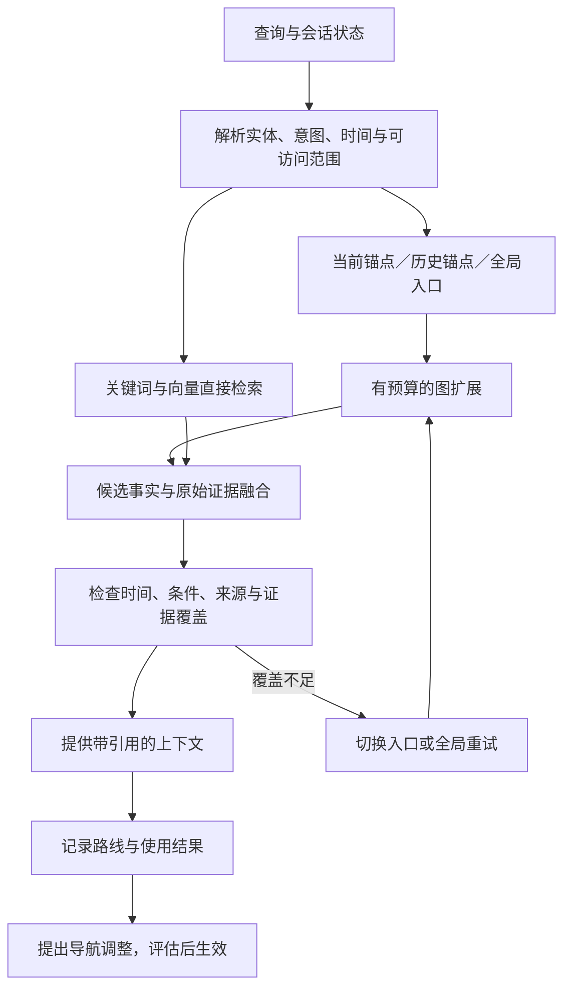

# Continuum Memory：图记忆机制与文献研读

检索与核对日期：2026-09-16。

对应材料：用户提供的《Continuum Memory 项目计划书》V2.2（2026-09-15），重点对照第 5–7 页的核心机制、分层架构和边界，以及第 11–14 页的评估、相关工作与参考文献。本次阅读材料、核对论文方法；未修改计划书，也未复跑项目基准。

本文区分“论文提出的机制”和“针对本项目的设计建议”。下文的字段、示例、实施次序是建议，不代表当前代码已经实现。方法细节以链接标注的论文版本为准；不将不同论文的分数直接横向比较。

## 1. 与这版计划书最相关的结论

计划书已经明确了稳定的 V4 事实与证据内核、可重建的语义图投影，以及包含 Current Anchor、Historical Anchor、Global Landmark 的导航图。最需要补充的是这两层之间的转换规范：原始对话里哪些内容值得记录，怎样抽成事实，怎样消歧并保留条件，怎样让图上的路径最终落回可靠证据。

建议将问题拆为四个可分别验证的环节：

1. **捕获**：从消息、工具结果和文件中提取实体、事实、事件及其出处。
2. **组织**：合并同一实体的别名，区分关系类型，处理时间、条件和冲突。
3. **利用**：把问题映射到入口，沿关系找证据，保留直接检索通路。
4. **演化**：根据使用结果调整导航与视图；事实修订仍走独立的证据流程。

“图”首先是逻辑表示与访问方式。当前阶段可用已有存储承载节点表、边表和邻接索引；是否迁移图数据库，应由实测访问负载决定。

## 2. 优先阅读的文献

### 2.1 Zep：实体、时态事实和证据来源

**Rasmussen et al. (2025), Zep: A Temporal Knowledge Graph Architecture for Agent Memory.** [论文与方法全文](https://arxiv.org/html/2501.13956v1)。优先读 §2.1–2.2、§3、附录 §6.1。

论文从原始 Episode 抽取实体与事实；用向量、全文检索召回候选，再由模型判断实体是否重复。事实带有效时间和系统记录时间，矛盾更新通过失效时间保存历史；语义记录可追溯原始 Episode。检索组合向量、BM25、邻域搜索与重排。

**对应本项目**：补充实体归一化和时态事实写入规范。原文采用新信息优先的冲突策略；本项目应另行处理迟到记录、条件差异与来源可靠性，避免按写入先后一律覆盖。

### 2.2 HippoRAG 2：从关系线索找回完整上下文

**Gutiérrez et al. (2025), From RAG to Memory: Non-Parametric Continual Learning for Large Language Models.** [ICML 2025 正式出版页](https://proceedings.mlr.press/v267/gutierrez25a.html)；[方法全文](https://arxiv.org/html/2502.14802v1)。优先读 §3.1–3.5。

从段落抽取三元组，构建短语节点、关系边、同义连接，并把原始段落作为节点接入。查询先匹配三元组，经模型过滤后形成图搜索线索，再用个性化 PageRank 排序段落；无有效三元组时退回向量检索。

**对应本项目**：图用于发现关联，最终返回 Fact 和 Episode 证据。可作为固定图基线。其段落节点也参与检索初始化，不能把论文机制直接描述成只访问小片局部图。

### 2.3 MemORAI：带来源的异构图与查询相关权重

**Van et al. (2026), MemORAI: Memory Organization and Retrieval via Adaptive Graph Intelligence for LLM Conversational Agents.** [Findings of ACL 2026](https://aclanthology.org/2026.findings-acl.1408/)；[方法全文](https://arxiv.org/html/2605.01386v1)。优先读 §3、附录 C。

先按主题分段，筛选个人事实等值得记忆的内容。图包含实体、对话轮次、段落及来源连接。查询从实体、关系和段落多路选种子，一跳扩展成子图，再按查询与描述的相关性加权 PageRank，取回原始轮次和三元组。

**对应本项目**：可参考其局部子图和证据回溯。它的动态权重主要随当前查询改变，不等于长期反馈学习；个人画像过滤也需扩展才能覆盖工程日志与项目决策。

### 2.4 MAGMA：分类型关系、锚点与 Beam 遍历

**Jiang et al. (2026), MAGMA: A Multi-Graph based Agentic Memory Architecture for AI Agents.** [ACL 2026](https://aclanthology.org/2026.acl-long.1709/)；[方法全文](https://arxiv.org/html/2601.03236v1)。优先读 §3.2–3.4、Algorithm 1–3。

事件包含内容、时间、向量和属性；关系分语义、时间、因果、实体四类。系统快速写入事件，后台补充关系。查询按意图融合检索入口，再用 Beam Search 按关系类型和语义相关性扩展，最后组织证据上下文。

**对应本项目**：最接近锚点入口和有预算的图导航。但其查询锚点不等于持久化的当前／历史锚点；模型推断的因果关系也不能直接当作已证实原因。

### 2.5 AriGraph：语义记忆与情景记忆连接

**Anokhin et al. (2024 预印本), AriGraph: Learning Knowledge Graph World Models with Episodic Memory for LLM Agents.** [方法全文](https://arxiv.org/html/2407.04363v1)。优先读 §2、Algorithm 1、附录 A 和 D。

从环境观察抽取三元组，将它们与对应的原始观察关联；先检索并扩展语义关系，再回取相关情景，供规划与行动使用。

**对应本项目**：支持 Entity／Fact／Episode 联动，但论文主要评估 TextWorld 环境任务。其移除过时语义边的做法，移植时应适配本项目保留历史与回退的要求。

### 2.6 A-MEM：原子笔记与关联更新

**Xu et al. (2025), A-Mem: Agentic Memory for LLM Agents.** [方法全文](https://arxiv.org/html/2502.12110v1)。优先读 §3、附录 C 的提示模板。

笔记包含原文、时间、关键词、标签、情境描述、向量和关联。先找相近旧笔记，再由模型判断连接，并更新相关笔记的描述等属性。所读 v1 的 §3.4 仍用向量相似度选择 top-k 笔记。

**对应本项目**：适合启发可重叠的 View 和候选关联生成；不能仅因存在链接，就称其实现了反馈驱动的多跳导航。衍生描述与原始证据应分开保存。

### 2.7 GraphRAG：社区摘要作为全局入口

**Edge et al. (2024), From Local to Global: A Graph RAG Approach to Query-Focused Summarization.** [方法全文](https://arxiv.org/html/2404.16130v1)。优先读 §2.2–2.6。

从文本抽取实体、关系与描述，利用 Leiden 构造层次社区并生成摘要；全局问题通过社区级回答的汇总来处理。

**对应本项目**：可启发 Global Landmark 的主题摘要和层级入口。但社区划分、语义摘要与用户使用反馈是不同信号；论文的主要任务是文档集合的全局总结。

### 2.8 SAGE：读写闭环的进一步研究

**Wang et al. (2026 预印本), SAGE: A Self-Evolving Agentic Graph-Memory Engine for Structure-Aware Associative Memory.** [方法全文](https://arxiv.org/html/2605.12061v1)。优先读 §4、附录 O。

增量图写入器产生三元组；图基础模型承担读取，并提供检索质量等反馈。论文采用 GRPO 优化写入器。

**对应本项目**：适合支撑“用读取结果改进记忆组织”的研究动机；它涉及训练，不宜等同于首月的轻量导航边调整，也不是无需训练就能获得同等效果的依据。

### 2.9 EvolveMem：失败诊断与配置回退

**EvolveMem: Self-Evolving Memory Architecture via AutoResearch for LLM Agents (2026 预印本).** [方法全文](https://arxiv.org/html/2605.13941v1)。优先读 §3、附录 B。

将记忆分类存储，以关键词、向量和结构化属性多路检索；诊断模块读取逐题失败日志，提出配置调整，评估退化时恢复较优配置。

**对应本项目**：启发 Shadow 评估和策略回退。其多视图主要指检索通路，不能直接作为图中 CREATE_VIEW／SPLIT_VIEW／MERGE_VIEW 有效性的证明。

## 3. 如何捕获要素：建议的写入流程

以下为针对本项目的综合设计建议，不是任何一篇论文的原样方案。

### 3.1 先定义要素，而不只是定义节点和边

| 要素 | 最小记录内容 | 用途 |
|---|---|---|
| Episode 原始记录 | 原文或引用、说话者／工具、记录时间、所属范围、内容指纹 | 审计、引用、重新抽取 |
| Entity 实体 | 稳定 ID、名称、别名、类型、描述、来源 | 识别跨轮次提及的同一对象 |
| Fact 事实或主张 | 主体、谓词、客体／数值、条件、否定／计划状态、有效时间、证据 | 回答具体问题和处理变化 |
| Event 事件 | 动作、参与者及角色、对象、发生时间、状态、原因证据（如有） | 还原决策和变化过程 |
| Semantic Edge 语义关系 | 两端 ID、关系类型、支撑的 Fact ID、生成版本 | 沿实体与事实关系访问 |
| View／Landmark | 成员引用、范围、摘要、代表线索、版本 | 导航和主题重定位 |
| Anchor | 所属会话／用户、激活的区域、强度、最近访问时间 | 保留检索入口状态 |
| Outcome 使用结果 | 查询／路线／证据 ID、结果类型、反馈来源、成本、版本 | 评估和调整导航 |

Episode 是证据记录，Event 是记录描述的现实或计划事件，二者不必一一对应。View 和 Anchor 是组织、访问记忆的状态，不能当作从原文抽出的客观事实。

### 3.2 具体步骤

1. **记录来源与范围。** 先落盘原始记录及 owner、agent、session、项目范围。来自助手的建议、用户确认、工具观测应标记不同来源类型。
2. **分段与记忆筛选。** 按主题或事件切分，优先保留偏好、约束、承诺、决策、项目状态、失败经验。项目助手不能只保留个人画像；被筛掉的原始材料可按保留策略用于补抽。
3. **结构化抽取。** 用结构化输出提取“谁、做了什么、涉及什么、何时、在哪种条件下、处于何种状态”，每项要求原文引用位置。规则处理明确 ID、时间格式等，模型处理指代和自然语言关系。
4. **校验证据。** 验证字段、实体引用和引用片段确实存在。将“计划采用”“可能采用”“已经采用”分开。模型生成的置信分不能直接当作经过校准的正确概率。
5. **实体消歧。** 先用稳定标识和范围约束，再用别名、词法、向量寻找候选，最后结合上下文判断；相似名称本身不足以合并。记录合并映射，支持纠错。
6. **处理重复与冲突。** 先比较主体、谓词、环境条件和有效时间，再判断是重复、补充、变化还是冲突。“测试用 SQLite”和“部署用 PostgreSQL”应并存。迟到消息不能仅因写入更晚就覆盖更新的现实状态。
7. **提交事实，再构建投影。** 通过既定写入流程提交证据与事实，语义图存储引用和邻接结构；导航相似边、共访边或捷径边另行标记。

首轮抽取可采用小而明确的关系集合，例如 `uses`、`prefers`、`assigned_to`、`depends_on`、`supersedes`。不必在首月开放自动生成本体或任意数据库操作。

### 3.3 一个假设示例

以下是为说明机制编造的输入，不是项目真实记录：

> 9 月 1 日：项目 A 的本地演示库今天启用 SQLite。
>
> 9 月 12 日：从今天起，项目 A 的本地演示库已换成 PostgreSQL；测试仍使用 SQLite。

应得到：

| 记录 | 主体—关系—客体 | 条件 | 时间解释 |
|---|---|---|---|
| F1 | 项目 A—uses—SQLite | 本地演示 | 9 月 1 日起，9 月 12 日结束 |
| F2 | 项目 A—uses—PostgreSQL | 本地演示 | 9 月 12 日起生效 |
| F3 | 项目 A—uses—SQLite | 测试 | 9 月 12 日观测到仍在使用；起始时间未知 |

F1 和 F2 有同条件下的替代关系，F3 则不与 F2 冲突。三条记录都应回链到原文。“为什么换数据库”没有足够证据，应保留未知，不能从先后发生推断原因。

逻辑字段示意：

```json
{
  "factId": "F2",
  "subjectId": "project-A",
  "predicate": "uses",
  "objectId": "PostgreSQL",
  "qualifiers": { "environment": "local-demo" },
  "modality": "asserted-current",
  "validFrom": "2026-09-12",
  "validTo": null,
  "sourceEpisodeId": "example-episode-2",
  "evidenceText": "从今天起，项目 A 的本地演示库已换成 PostgreSQL",
  "provenanceType": "user-statement"
}
```

这仅是结构示意；实际记录还需要所属范围、系统写入时间和抽取版本。用户陈述说明证据来源，并不自动表示经过外部事实核验。

## 4. 如何运用要素：建议的读取流程



1. **解析问题。** 除关键词外，识别目标实体、关系、环境条件、时间范围和问题类型。当前状态查询、过去状态查询、变化过程查询应采用不同的时间判定。
2. **选入口。** 当前锚点服务连续话题；历史锚点服务主题回访；全局入口服务新话题或偏离现有区域的问题。三路是否融合、预算如何分配，应作为策略参数验证。
3. **沿关系找候选。** 实体关联补充同一对象的事实，时间关系找前后状态，来源关系找原始记录，依赖关系帮助跨记录组合。每步执行范围检查并限制邻居数、深度和总预算。
4. **选一种图排序基线。** 首先比较固定的有界 Beam 与查询相关的 PageRank，不要一开始叠加多套算法。PageRank 可理解为：把相关性分数从查询入口向邻居传播，同时保留返回入口的概率。
5. **融合并核验证据。** 图返回的 ID 回查 V4 的事实与来源；直接检索结果也参与融合。保留必要的条件和时间限定，避免摘要抹掉差异。
6. **不足时恢复搜索。** 局部结果不足以覆盖问题时重定位或检索原始记录。过去有效、现在失效的事实仍可能是历史问题的正确答案，不能全局过滤掉。
7. **记录结果而非臆测结果。** 区分“被检索”“被答案引用”“用户明确确认”“用户纠正”。没有反馈应记未知；被频繁访问不等于事实更真实。

对上面的假设例子：“现在演示用什么”取 F2；“9 月 5 日用什么”取 F1；“测试和演示是否一致”联合 F2、F3，并保留不同条件。“为何切换”则需要额外原因记录。

## 5. 对计划书的具体补充建议

**在第 6 页架构前补一个“要素抽取与规范化”步骤。** 交代抽取输入、字段、引用要求、实体合并和冲突判定。否则图导航即使有效，也可能是在不完整或错误的要素上搜索。

**明确语义边与导航边的证据等级。** 事实关系、同义实体、语义相似、共访和成功路线属于不同关系。尤其“相似”“共同出现”“先后发生”不能替代因果证据；导航反馈也不直接改写事实真值。

**补全可重建的条件。** `sourceRevision + builderVersion` 之外，还需要持久化抽取结果、规范实体映射以及衍生结构版本。若每次重建都重新调用模型做抽取或总结，同一输入也未必得到同一图。投影重建应尽量回放已保存的规范记录；模型升级导致的重新抽取，应产生新版本。

**收紧“创新点”的边界。** 建议将研究贡献集中于：在事实层可追溯、可回退的约束下，验证当前／历史／全局入口及反馈驱动视图演化，能否改善连续使用时的检索成本和恢复能力。已有论文分别覆盖了图构建、查询相关遍历、读写反馈或配置优化，不能仅以使用图或锚点作为原创性证据。

**补充上游和端到端评估。** 除计划书已有的 Recall、节点访问量与 P95，还应测量：

| 环节 | 建议指标或测试 |
|---|---|
| 捕获 | 实体／关系抽取精确率和召回率，证据片段正确率，时间与条件保留率 |
| 归一化 | 同名异物误合并、同物异名漏合并、条件不同的事实误冲突 |
| 运用 | 证据 Recall@k、时态问题正确率、多跳证据完整率、无答案时的正确保留未知 |
| 成本 | 候选评分数、邻居扩展数、模型调用与 token、构图／更新耗时、端到端 P95 |
| 演化 | 固定图与演化图对照，局部失败后的恢复率，跨话题退化和回退可复现性 |

节点访问减少不自动等于整体成本下降：入口检索、向量评分、重排和后台更新也要计入。用开发集提出调整，用验证集选择方案，另留不参与调参的测试集；反复用同一验证集做演化仍可能过拟合。

## 6. 可补入计划书的技术描述（建议稿）

项目拟采用“证据保留—要素抽取—时态归一化—图检索—反馈演化”的记忆处理流程。系统保留原始消息及来源，从中提取实体、事实、事件、时间和适用条件，经实体消歧及冲突校验后写入事实内核，并构建可重建的语义图投影。查询阶段结合当前锚点、历史锚点与全局入口，在范围和计算预算约束下扩展关联，融合直接检索结果并回溯原始证据。用户确认、纠正和检索失败用于提出导航权重及视图调整；候选调整经影子评估后生效，退化时回退。上述机制的收益将通过固定图、无反馈、无历史锚点及无全局重试等对照实验验证。

建议阅读次序：**Zep → HippoRAG 2 → MemORAI → MAGMA**，先确定要素和检索基线；再读 A-MEM、GraphRAG 设计视图与全局入口，最后读 SAGE、EvolveMem 规划后续演化实验。
